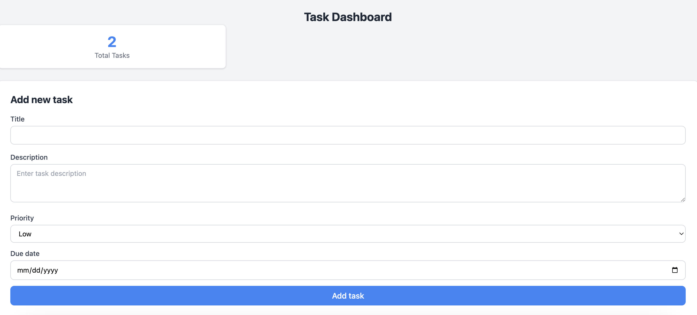
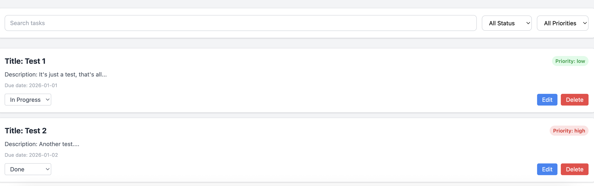

# Task Dashboard

## Features

- Add, edit and delete tasks
- Set priority levels (low, medium, high)
- Track task status (todo, in-progress, done)
- Filter tasks by status and priority
- Search tasks by title
- Data persists between page refreshes and using localStorage

## Tech Stack

- React
- Typescript
- Tailwind CSS

## Project structure

task-dashboard/
├── src/
│ ├── components/
│ │ ├── TaskList/
│ │ │ ├── TaskList.tsx
│ │ │ └── TaskItem.tsx
│ │ ├── TaskForm/
│ │ │ └── TaskForm.tsx
│ │ ├── TaskFilter/
│ │ │ └── TaskFilter.tsx
│ │ └── Dashboard/
│ │ └── Dashboard.tsx
│ ├── types/
│ │ └── index.ts
│ ├── utils/
│ │ └── taskUtils.ts
│ ├── App.tsx
├── main.tsx
└── package.json

### Interfaces & What it's for..?

- Task - The main task data structure
- TaskFormdata - What the form holds while typing
- TaskFormProps - Props passed into Taskform
- TaskItemProps - Props for single task row
- TaskListProps - Props for the full task list
- TaskFilterOptions - The active filter state
- TaskFilterProps - Props passed into TaskFilter
- FormErrors - Validation error messages
